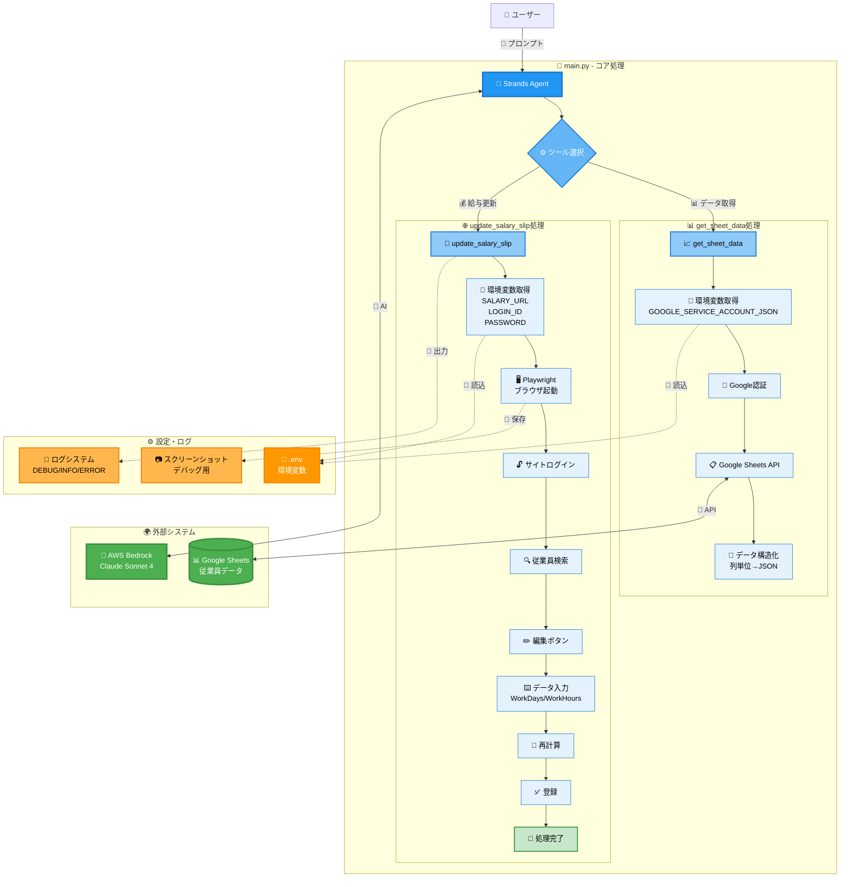

# my-agentcore-browser
AgentCore Browser - 給与明細自動更新システム

## アーキテクチャ図



## システム概要

本システムは、Google Sheetsから従業員データを取得し、Webベースの給与システムに自動でログインして給与明細を更新するAIエージェントです。

### 主要機能

1. **データ取得** (`get_sheet_data`)
   - Google Sheets APIで従業員データを取得
   - 列単位でのデータ構造化
   - 環境変数による認証情報管理

2. **給与明細更新** (`update_salary_slip`)
   - Playwrightによるブラウザ自動化
   - Webアプリへの自動ログイン
   - 従業員検索・選択・データ入力
   - 再計算・登録処理

3. **AI制御**
   - Strands フレームワークによるツール選択
   - AWS Bedrock Claude Sonnet 4 による自然言語処理

```bash
curl -LsSf https://astral.sh/uv/install.sh | sh
uv version

uv venv
source .venv/bin/activate

uv add bedrock-agentcore playwright strands-agents

uv add google-auth google-auth-oauthlib google-auth-httplib2 google-api-python-client
```

```bash
uv run main.py 
```

```bash
curl -X POST http://localhost:8080/invocations \
  -H "Content-Type: application/json" \
  -d '{"prompt": "sheet_idのsheet_nameからデータを取得して給与明細を更新して"}'
```

```json
{
  "Version": "2012-10-17",
  "Statement": [
    {
      "Sid": "AssumeRolePolicy",
      "Effect": "Allow",
      "Principal": {
        "Service": "bedrock-agentcore.amazonaws.com"
      },
      "Action": "sts:AssumeRole",
      "Condition": {
        "StringEquals": {
          "aws:SourceAccount": "XXXXXXXXXXXX"
        },
        "ArnLike": {
          "aws:SourceArn": "arn:aws:bedrock-agentcore:us-east-1:XXXXXXXXXXXX:*"
        }
      }
    }
  ]
}
```

```json
{
  "Version": "2012-10-17",
  "Statement": [
    {
      "Sid": "ECRImageAccess",
      "Effect": "Allow",
      "Action": [
        "ecr:BatchGetImage",
        "ecr:GetDownloadUrlForLayer"
      ],
      "Resource": [
        "arn:aws:ecr:us-east-1:XXXXXXXXXXXX:repository/my-agentcore-browser"
      ]
    },
    {
      "Sid": "ECRTokenAccess",
      "Effect": "Allow",
      "Action": [
        "ecr:GetAuthorizationToken"
      ],
      "Resource": "*"
    },
    {
      "Sid": "CloudWatchLogs",
      "Effect": "Allow",
      "Action": [
        "logs:DescribeLogStreams",
        "logs:CreateLogGroup",
        "logs:DescribeLogGroups"
      ],
      "Resource": [
        "arn:aws:logs:us-east-1:XXXXXXXXXXXX:log-group:/aws/bedrock-agentcore/runtimes/*",
        "arn:aws:logs:us-east-1:XXXXXXXXXXXX:log-group:*"
      ]
    },
    {
      "Sid": "CloudWatchLogsWrite",
      "Effect": "Allow",
      "Action": [
        "logs:CreateLogStream",
        "logs:PutLogEvents"
      ],
      "Resource": [
        "arn:aws:logs:us-east-1:XXXXXXXXXXXX:log-group:/aws/bedrock-agentcore/runtimes/*:log-stream:*"
      ]
    },
    {
      "Sid": "XRayAccess",
      "Effect": "Allow",
      "Action": [
        "xray:PutTraceSegments",
        "xray:PutTelemetryRecords",
        "xray:GetSamplingRules",
        "xray:GetSamplingTargets"
      ],
      "Resource": ["*"]
    },
    {
      "Sid": "CloudWatchMetrics",
      "Effect": "Allow",
      "Resource": "*",
      "Action": "cloudwatch:PutMetricData",
      "Condition": {
        "StringEquals": {
          "cloudwatch:namespace": "bedrock-agentcore"
        }
      }
    },
    {
      "Sid": "GetAgentAccessToken",
      "Effect": "Allow",
      "Action": [
        "bedrock-agentcore:GetWorkloadAccessToken",
        "bedrock-agentcore:GetWorkloadAccessTokenForJWT",
        "bedrock-agentcore:GetWorkloadAccessTokenForUserId"
      ],
      "Resource": [
        "arn:aws:bedrock-agentcore:us-east-1:XXXXXXXXXXXX:workload-identity-directory/default",
        "arn:aws:bedrock-agentcore:us-east-1:XXXXXXXXXXXX:workload-identity-directory/default/workload-identity/*"
      ]
    },
    {
      "Sid": "BedrockModelInvocation",
      "Effect": "Allow",
      "Action": [
        "bedrock:InvokeModel",
        "bedrock:InvokeModelWithResponseStream"
      ],
      "Resource": [
        "arn:aws:bedrock:*::foundation-model/*",
        "arn:aws:bedrock:us-east-1:XXXXXXXXXXXX:*"
      ]
    }
  ]
}
```

```bash
agentcore status
```
